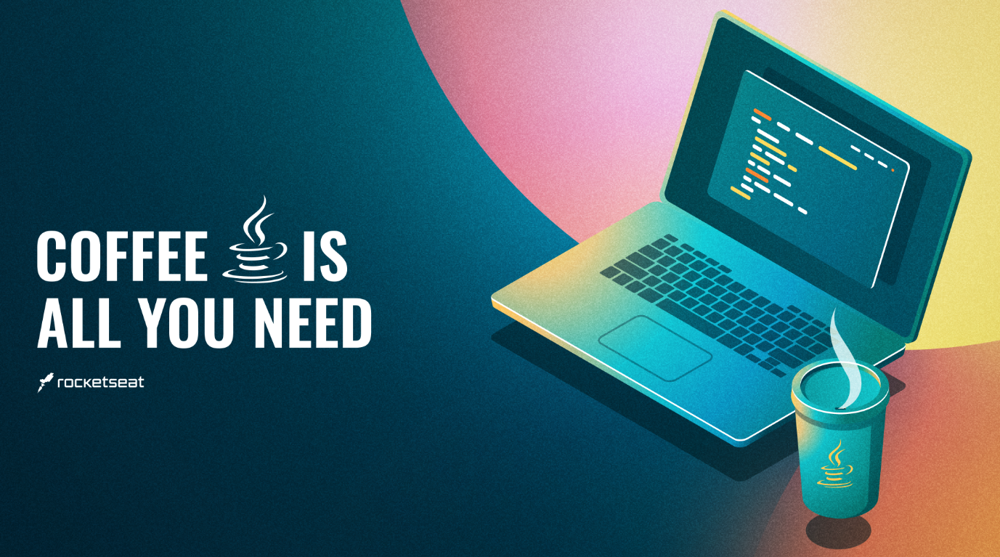

  <h1 align="center"> 🚀 Todo List - Rocketseat 🚀</h1>
  

  
   
  
  
  
  

<strong>
  

    <a href="#-about">About</a> |
    <a href="#-demo">Demo</a> |
    <a href="#-dependencies">Dependecies</a> |
    <a href="#-functionalities">Functionalities</a> |
    <a href="#-technologies">Technologies</a> |
    <a href="#-how-to-execute-and-download">How to execute</a> |
    <a href="#-author">Author</a> | 
    <a href="#-show-your-support">Suport</a>
  

</strong>

## 🧐 About
This project it's a task's management, with it we can handle tasks as well as users, bacause we need them to execute the project's functionalities

All features could be used through software capable of to make requests following the HTTP patterns, like POSTMAN for example.

## 👀 Demo

> Deploy's endpoint -> https://todolist-rocketseat-5zd1.onrender.com/

## 🫡 Dependencies
To run this project in your machine, you will need to install some dependencies and made some configurations, therofere use this [documentation](https://efficient-sloth-d85.notion.site/Curso-de-Java-2408d11bfc3447e980fe9460b6293976):
- [Java & Kit](https://www.oracle.com/java/technologies/javase/jdk16-archive-downloads.html)
- [Maven](https://maven.apache.org/)
- [IntelliJ IDEA](https://www.jetbrains.com/idea/)
- [Postman](https://www.postman.com/)

## 🖥 Functionalities

:new: Create User:
- You need to create an user to be able to create a tasks and management it.

:new: Create Tasks:
- Now you can create a task, provided that the user was authenticated!
  - Because when you are creating a task, you need to pass a basic authorization (username, password), it's have to be the same previously registered.

:recycle: Update Tasks:
- You could update a specific tasks, just passing the ID and desired fields.
  - The application will make a merge with fields are blanks and not blanks, as well as the authenticated.

:page_with_curl: List Tasks:
- You could see all tasks, that you are responsible, as well as the authenticated.
  

## 👷 How to <b>Execute<b> and [Download](https://github.com/edward-mn/todolist/archive/refs/heads/main.zip)

### Local 🏡

#### Downloading & Execute the project ⏬
1. Download the project on your machine.
2. Extract the downloaded zip.
3. Create a new project from an existing project (**Import project**).
4. After the project loaded in your IDE click with the right button on the project name -> Maven -> Reimport to confirm the necessary imports.
5. Click on the top right of your ide (ADD CONFIGURATIONS) -> (+) -> Maven.
6. In the "Command Line" field add (spring-boot:run) -> Apply -> OK.
7. Ready now, just run the program and the server is running on port 8080.
8. Ready to access!
9. Open your browser into port 8080 (<i> http://localhost:8080/ </i>)

### Everywhere 🗺

### Using Postman 👨‍🚀
1. Open the postman
2. Import the collection
   1. In the upper left corner click (Import) -> Choose Files -> Go to where you extracted the project and the select the [Bootcamp - Rocketseat | Java ☕](./src/main/resources/static/Postman/Bootcamp-Rocketseat-Java.postman_collection.json) file
   2. Now, select the endpoint that you want within the imported collection and click in send.
   3. Use as you want and wish! 

## 🛠 Technologies
- [IntelliJ IDEA](https://www.jetbrains.com/idea/)
- [Java 17 & Kit](https://www.oracle.com/java/technologies/javase/jdk17-archive-downloads.html)
- [Spring boot](https://spring.io/projects/spring-boot)
- [H2](https://www.baeldung.com/spring-boot-h2-database)
- [Postman](https://www.postman.com/)
- [Render](https://dashboard.render.com/)
- [Docker](https://www.docker.com/)
- [Dependencies - Maven](https://mvnrepository.com/artifact/org.springframework.boot/spring-boot-starter)
  - [Loombok](https://projectlombok.org/)
  - [DevTools](https://www.baeldung.com/spring-boot-devtools)
  - [Data JPA](https://spring.io/projects/spring-data-jpa)
  - [Spring Web](https://docs.spring.io/spring-boot/docs/current/reference/htmlsingle/)
  - [H2](https://www.baeldung.com/spring-boot-h2-database)
  - [Bcrypt](https://www.npmjs.com/package/bcrypt)
  - [Starter Validation](https://www.baeldung.com/spring-boot-bean-validation)

## 🦹‍ Author

* [**Edward Moreira**](https://aboute-me.netlify.app/)
* [@edward-mn](https://github.com/edward-mn) :octocat:
*  
* [Edward Moreira](https://app.rocketseat.com.br/me/edward-moreira-do-nascimento-02578) :rocket:

## 🤝 Show your support

Give a ⭐️ if liked or helped you!

***

<strong>
  
 This README was created with ❤️ by me 

</strong>
